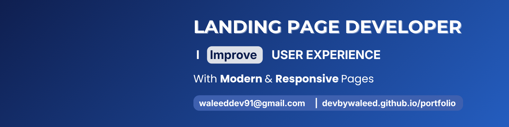

 

  

<h3 align="center">Solving real-world problems by responsive and modern web experiences 🌐</h3>

---

### ✨ About Me

Hi! I'm **Waleed Ahmed**, a **Frontend Developer & Freelancer from Pakistan 🇵🇰**.  
I specialize in creating **responsive websites, interactive UIs, and optimized user experiences**.  
I’m currently improving my skills in **React, Tailwind CSS, and modern JavaScript frameworks** to deliver scalable and professional web solutions.  

---

### 🚀 Skills / Tech Stack

   
   
   
   
   
   
   
   
   

---

### 💼 Featured Projects

| Project | Description | Tech Stack |
|----------|--------------|------------|
| 🌐 [Portfolio Website](https://devbywaleed.github.io/portfolio/) | Showcases my work, skills, and client projects in a modern layout. | HTML5, CSS3, Bootstrap-Icons, JS |
| 🔍 [RepoScanner](https://devbywaleed.github.io/RepoScanner/) | A responsive web app to scan github repository for specific file. | HTML5, CSS3, JS |
| 🌐 [LMS Clone](https://devbywaleed.github.io/lms-clone/) | A responsive clone of LMS login page of Virtual University. | HTML5, TailwindCSS |
| 💻 [Python Projects](https://github.com/devByWaleed/py-projects/) | Repository of Python Projects. | PF, PIP, OOP, DSA |

---

### 🧠 Currently Learning / Focus

- Advanced **React** (hooks, context, and optimization)  
- **Freelance web project management** & client handling  
- **UI/UX design** and responsive principles  
- Exploring **JavaScript frameworks** and **API integration**  

---

### 🎉 Fun Facts About Me

   
   
   
   

- 💡 I love building creative and useful digital solutions.  
- 🧩 Constantly learning and improving every single day.  
- 🧠 Constantly gaining new ideas to solve real-world problems.

---

### 💬 Daily Inspiration  

  

---

### 📊 GitHub Stats & Achievements

  

  

---

### 🤝 Freelance & Collaboration

I’m open to **freelance projects** and **collaborations** on web development.  
Let’s work together to build something impactful and creative 🌟  

📫 Reach me at: **waleed.cool1857@gmail.com**

---

### 🔗 Connect with Me

  
  
  
  
  
  
  

---

⭐ **Let’s create something impactful together!**  
If you like my work, consider giving a ⭐ on my projects — it motivates me to keep building. 🚀
